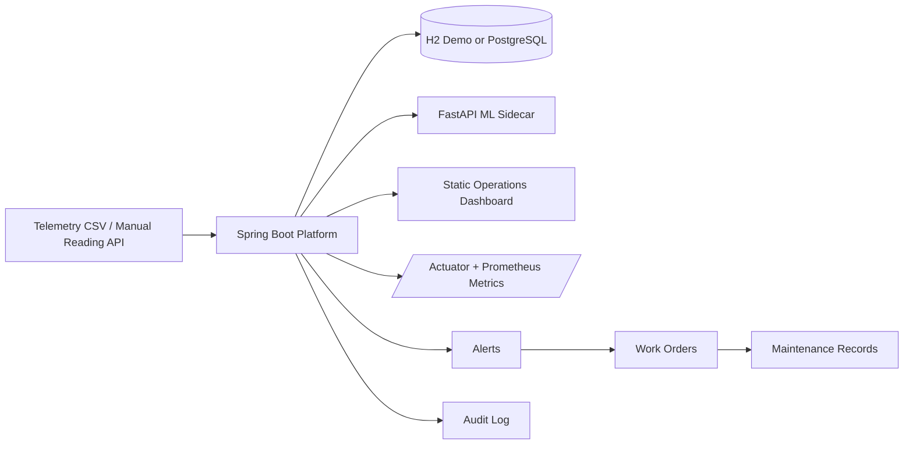

# Energy Ops Canada

Energy Ops Canada is a Canadian energy operations monitoring and predictive maintenance platform for operations teams that need asset health visibility, alert prioritization, and maintenance workflow tracking. It is built for an Alberta-flavoured demo environment and now supports a production-shaped path with profile-based storage, Flyway migrations, Prometheus-ready metrics, and a stateless Docker workflow.

## Business value

- Reduce downtime by surfacing asset health and failure risk before breakdowns.
- Give operations engineers a single workflow from telemetry ingest to alert to work order to maintenance closeout.
- Keep the demo realistic with Canadian validation, metric units, and seeded Alberta operating data.
- Preserve a fast local demo path while adding PostgreSQL and observability for a more production-like story.

## Architecture



## Tech stack

- Backend: Java 21, Spring Boot 3.5, Spring Security, Spring Data JPA, Flyway
- Storage: H2 for demo mode, PostgreSQL for persistent mode
- ML: FastAPI sidecar with rule-engine fallback in the Java service
- Frontend: static HTML, CSS, and vanilla JavaScript served by Spring Boot
- Observability: Spring Boot Actuator and Prometheus metrics endpoint
- Infra: Docker Compose, PowerShell Docker lifecycle scripts, WSL resource guardrails
- Testing: JUnit 5, MockMvc, Spring Security Test

## Product workflow

### Monitor

- Dashboard metrics, site risk summaries, and asset ranking
- Asset detail drill-down with recent telemetry and active alerts
- Canadian formatting, province validation, and Mountain Time defaults

### Detect

- CSV seed import and manual telemetry ingestion
- Local scoring fallback plus optional Python ML scoring
- Alert deduplication window and risk-aware priority assignment

### Respond

- Alert acknowledgement, assignment, and resolution
- Work order creation from an alert or directly from an asset
- Technician closeout with downtime, parts replaced, and completion notes

### Review

- Maintenance history for completed interventions
- Audit log of key operational actions
- Prometheus-ready application metrics and health endpoints

## Profiles and environments

| Profile | Storage | ML | Intended use |
| --- | --- | --- | --- |
| `demo` (default) | H2 in-memory | Optional | Fast local run, interviews, screenshots |
| `postgres` | PostgreSQL + Flyway | Optional | Persistent local development |
| `docker` | PostgreSQL + Flyway | Enabled by default | Stateless container demo with reset-on-start |

## Demo users

| Role | Username | Password |
| --- | --- | --- |
| Admin | `admin.ca` | `admin123` |
| Operations Engineer | `ops.lead` | `ops123` |
| Technician | `morgan.tech` | `tech123` |

## Quick start

### Local demo mode

```powershell
cd C:\Users\yisongwang\VSproject\Energy
.\mvnw.cmd spring-boot:run
```

Open:

- App UI: `http://localhost:8080`
- API health: `http://localhost:8080/api/health`
- Actuator health: `http://localhost:8080/actuator/health`
- Prometheus metrics: `http://localhost:8080/actuator/prometheus`
- H2 console: `http://localhost:8080/h2-console`

H2 settings:

- JDBC URL: `jdbc:h2:mem:energyops`
- Username: `sa`
- Password: empty

### Local PostgreSQL mode

Run a PostgreSQL instance locally, then start the app with:

```powershell
$env:SPRING_PROFILES_ACTIVE="postgres"
$env:ENERGY_DB_URL="jdbc:postgresql://localhost:5432/energyops"
$env:ENERGY_DB_USERNAME="energyops"
$env:ENERGY_DB_PASSWORD="energyops"
.\mvnw.cmd spring-boot:run
```

Flyway will create the schema from [V1__init_energy_ops_schema.sql](C:/Users/yisongwang/VSproject/Energy/src/main/resources/db/migration/V1__init_energy_ops_schema.sql).

### Optional ML sidecar

```powershell
cd C:\Users\yisongwang\VSproject\Energy\ml-service
py -m venv .venv
.\.venv\Scripts\Activate.ps1
pip install -r requirements.txt
uvicorn app:app --host 127.0.0.1 --port 8001
```

Then run the Java app with:

```powershell
$env:ENERGY_ML_ENABLED="true"
$env:ENERGY_ML_BASE_URL="http://127.0.0.1:8001"
.\mvnw.cmd spring-boot:run
```

## Docker and WSL guardrails

This repository now treats Docker as a disposable environment:

- PostgreSQL data is not persisted across runs.
- Compose resources are recreated each time with a no-cache rebuild.
- The Docker launcher overwrites `%USERPROFILE%\.wslconfig` on every start.
- WSL is constrained to an 8GB memory cap and an 8GB default VHD size for Docker-oriented runs.
- Docker build cache, project images, and anonymous volumes are pruned on each guarded run.
- Compose now waits for PostgreSQL and the ML sidecar health checks before starting the Spring Boot app.

Use the guarded startup script instead of running `docker compose up` directly:

```powershell
cd C:\Users\yisongwang\VSproject\Energy
.\ops\docker-fresh-up.ps1
```

To tear the environment down and remove project images and containers:

```powershell
cd C:\Users\yisongwang\VSproject\Energy
.\ops\docker-fresh-down.ps1
```

What the guarded script does:

1. Overwrites `%USERPROFILE%\.wslconfig` with an 8GB WSL envelope.
2. Shuts WSL down so the new settings apply.
3. Removes this project's containers, images, anonymous volumes, and Docker build cache.
4. Rebuilds everything with `--pull --no-cache`.
5. Starts PostgreSQL, the Spring Boot app, and the ML sidecar behind container health checks.

Docker endpoints:

- App: `http://localhost:8080`
- ML service: `http://localhost:8001`
- PostgreSQL: `localhost:5432`

## Select fields covered in the frontend

The dynamic select boxes are backed by these API sources:

- Manual reading `Asset`: `GET /api/assets`
- Manual reading `Site`: `GET /api/sites`, then auto-locked to the selected asset's site in the UI
- Create work order `Alert`: `GET /api/alerts` filtered to unresolved alerts
- Create work order `Asset`: `GET /api/assets`, with the current asset preselected and alert-linked assets auto-filled
- Maintenance `Work Order`: `GET /api/work-orders`, filtered in the UI to work orders that do not already have a maintenance record

Static select boxes:

- Create work order `Priority`: `HIGH`, `MEDIUM`, `LOW`

## API examples

### Login

```http
POST /api/auth/login
Content-Type: application/json

{
  "username": "ops.lead",
  "password": "ops123"
}
```

### Manual telemetry ingest

```http
POST /api/sensor-readings
Authorization: Bearer <jwt>
Content-Type: application/json

{
  "assetId": "AST-PMP-101",
  "siteId": "SITE-CLY-01",
  "timestamp": "2026-03-18T20:00:00",
  "temperatureC": 78.2,
  "pressureKpa": 845.6,
  "vibrationMmS": 4.1,
  "currentA": 152.0,
  "flowRateM3H": 208.4
}
```

### Public health and metrics

- `GET /api/health`
- `GET /actuator/health`
- `GET /actuator/prometheus`

## Telemetry and scoring

Telemetry fields currently tracked:

- Temperature (`deg C`)
- Pressure (`kPa`)
- Vibration (`mm/s`)
- Current (`A`)
- Flow rate (`m3/h`)

Scoring behaviour:

The ML component in this project is currently best described as a predictive scoring service rather than a fully trained production model. It looks at telemetry such as temperature, pressure, vibration, current, and flow rate, then returns health, anomaly, and failure-risk scores that drive alerts and work orders. I split it into a separate Python sidecar so the architecture already matches a production pattern where the core platform and the scoring service can evolve independently. If that sidecar is unavailable, the Java backend falls back to a local rules engine so the operational workflow still works safely. The next step is to replace more of the rules-based logic with a trained and versioned model without changing the application contract.

## Verification

Run the full test suite:

```powershell
.\mvnw.cmd test
```

Current automated verification covers:

- Application context startup
- Auth login
- Frontend select-box data sources through secured API endpoints
- Public actuator endpoints
- Creating a work order directly from an asset

## Repository layout

```text
.
|-- ops
|   |-- docker-fresh-down.ps1
|   `-- docker-fresh-up.ps1
|-- ml-service
|   |-- app.py
|   |-- Dockerfile
|   `-- requirements.txt
|-- src
|   |-- main
|   |   |-- java/ca/yisong/energyops
|   |   `-- resources
|   |       |-- db/migration
|   |       |-- static
|   |       `-- application-*.properties
|   `-- test
|-- Dockerfile
|-- docker-compose.yml
|-- pom.xml
`-- README.md
```

## Limitations and next steps

- The ML scoring path is still mostly rules-based and should evolve toward a trained model with versioned outputs.
- Telemetry is stored in relational tables today; a time-series backend would be the natural next step.
- The frontend is still a static SPA and would benefit from richer charts, filtering, and screenshot-driven documentation.
- Container observability is Prometheus-ready, but a full Grafana dashboard pack is still a next iteration.
